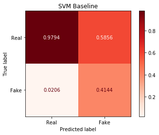
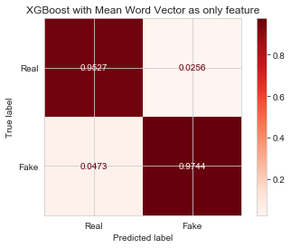

# NLP - Is the job posting Fake or Not?
## The Data:
- The dataset is from Kaggle: https://www.kaggle.com/shivamb/real-or-fake-fake-jobposting-prediction
- Original data set can be found: http://emscad.samos.aegean.gr
- Original data set contains 17,881 worldwide job postings
- Narrowed the scope to only job postings for the US market
  - 10656 total observations, 740 fake and 9926 real
  - A class imbalance of Minority class: 6.85% and Majority class: 93.15%
  - 16 initial total features (4 text features, job 'description' being the text to be evaluated with NLP techniques)
  - Target variable: 'fraudulent' 0 is real, 1 is fake
- Goals:
  - Perform Exploratory Data Analysis to identify key traits of job descriptions which are fraudulent in nature
  - Create a classification model that used text data features from job description postings in the United States to determine if a job posting was fraudulent or not
  - Use GloVe to create mean word vectors from 'description' corpus

## Data Cleaning, Initial Feature Engineering, and Initial EDA
Most of the features were categorical and missing many values.  The only columns not missing values were the job 'title' (dropped as a result of over 1000 different non-standardized titles), 'location' (dummied by state), and job 'description' (text document to be converted to a mean word vector value).  The remaining categorical features with large missing values were evaluated (dummied or dropped) with a Chi-Squared test to determine whether or not an imputed value was statistically significant in relation to the posting being fake or real.

 

## Baseline Models
4 baseline models were used: Logistic Regression, RandomForest Classifier, Support Vector Classifier, XGBoost Classifier.  The baseline models were run without the text data (job 'description') as a feature.  The lack of feature interactions were expected to heavily penalize the Logistic Regression model.  All models were run with PCA to reduce the feature space.  The primary evaluation metrics were precision and F1-Score as a job posting filter should let a few fake job postings through without filtering out too many real job postings.

#### Confusion Matrices (normalized predicted values) of 2 baseline models
 

- SVM baseline model: F1-Score of 0.5248 and Precision of 0.4144
  - Had more false positives than true positives
- XGBoost baseline model: F1-Score of 0.5121 and Precision of 0.5721
  - Made fewer false positive predictions but did not detect true fake job postings as well

## NLP Feature Engineering
The 'description' feature was converted to tokens and a mean word vector value (as an abstract sentiment vector) was returned using the Standford GloVe 50-dimensional word vector library (https://nlp.stanford.edu/projects/glove/).  The mean value vectors were then added on as features.

## Model Evaluation
The same metrics are the baseline model were used to evaluate the final models.  SVM and XGBoost had the best F1-Score and Precision.  XGBoost had the most viable model due to making very few false positive predictions.

#### Confusion Matrices (normalized predicted values) of the 2 best final models and XGBoost with the mean word vector as sole feature

  

- SVM final model: F1-Score of 0.7143 and Precision of 0.7582
  - Made far fewer false positives and only slightly more false negative predictions than the baseline model
- XGBoost final model: F1-Score of 0.7018 and Precision of 0.9444
  - Substantially better scores (except accuracy) across the board with respect to the baseline model
- XGBoost with only mean word vector: F1 Score of 0.4318 and Precision of 0.9744

## Further Exploration
- Add TF-IDF to features (maybe now if we have time)
- Use Neural Nets and transferred learning methods to further evaluate 'description'
- Deeper LDA analysis of 'description'

Presentation Slides: 

